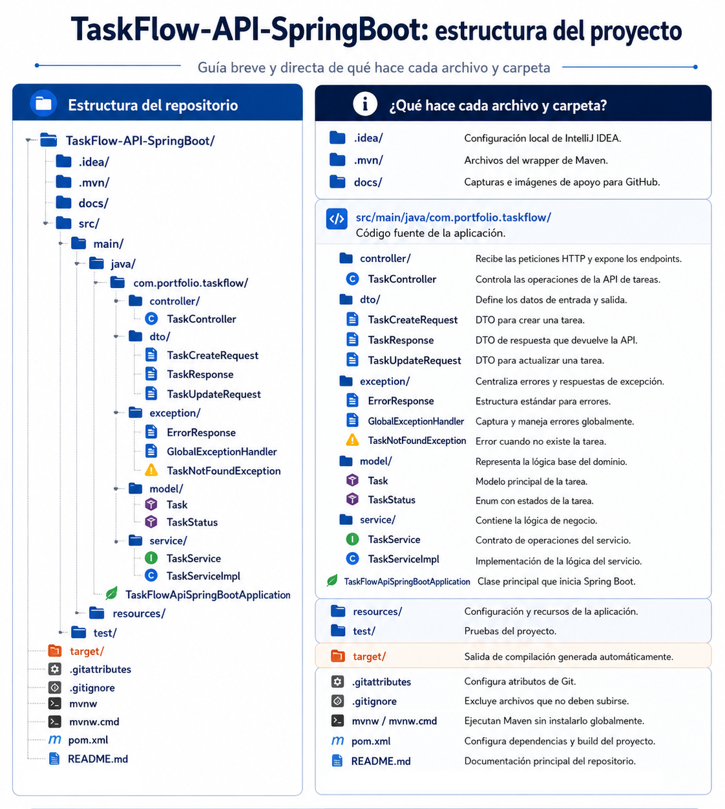

# TaskFlow API Spring Boot

API REST para la gestión de tareas desarrollada con Java y Spring Boot.

## Objetivo

Este proyecto tiene como objetivo demostrar conocimientos base en desarrollo backend con Spring Boot, arquitectura por capas, DTOs, validaciones, manejo global de errores y buenas prácticas de código limpio.

## Tecnologías utilizadas

- Java 21
- Spring Boot
- Spring Web
- Jakarta Validation
- Maven
- Postman
- Git/GitHub

## Arquitectura

El proyecto utiliza una arquitectura por capas simple:

Controller → Service → Model / DTO / Exception

## Funcionalidades

- Crear tareas
- Listar tareas
- Buscar tarea por ID
- Actualizar tarea
- Marcar tarea como completada
- Eliminar tarea
- Manejar errores de validación
- Manejar errores cuando una tarea no existe

## Endpoints

| Método | Endpoint | Descripción |
|---|---|---|
| GET | /api/tasks | Lista todas las tareas |
| GET | /api/tasks/{id} | Busca una tarea por ID |
| POST | /api/tasks | Crea una tarea |
| PUT | /api/tasks/{id} | Actualiza una tarea |
| PATCH | /api/tasks/{id}/complete | Marca una tarea como completada |
| DELETE | /api/tasks/{id} | Elimina una tarea |

## Estructura del Proyecto

## Autor

Proyecto desarrollado como parte de un portafolio profesional de desarrollo Backend Java / Full Stack Java.

## LICENCIA

MIT License

Copyright (c) 2026 Shelvy Carrasco Oré

Permission is hereby granted, free of charge, to any person obtaining a copy
of this software and associated documentation files (the "Software"), to deal
in the Software without restriction, including without limitation the rights
to use, copy, modify, merge, publish, distribute, sublicense, and/or sell
copies of the Software, and to permit persons to whom the Software is
furnished to do so, subject to the following conditions:

The above copyright notice and this permission notice shall be included in all
copies or substantial portions of the Software.

THE SOFTWARE IS PROVIDED "AS IS", WITHOUT WARRANTY OF ANY KIND, EXPRESS OR
IMPLIED, INCLUDING BUT NOT LIMITED TO THE WARRANTIES OF MERCHANTABILITY,
FITNESS FOR A PARTICULAR PURPOSE AND NONINFRINGEMENT. IN NO EVENT SHALL THE
AUTHORS OR COPYRIGHT HOLDERS BE LIABLE FOR ANY CLAIM, DAMAGES OR OTHER
LIABILITY, WHETHER IN AN ACTION OF CONTRACT, TORT OR OTHERWISE, ARISING FROM,
OUT OF OR IN CONNECTION WITH THE SOFTWARE OR THE USE OR OTHER DEALINGS IN THE
SOFTWARE.
